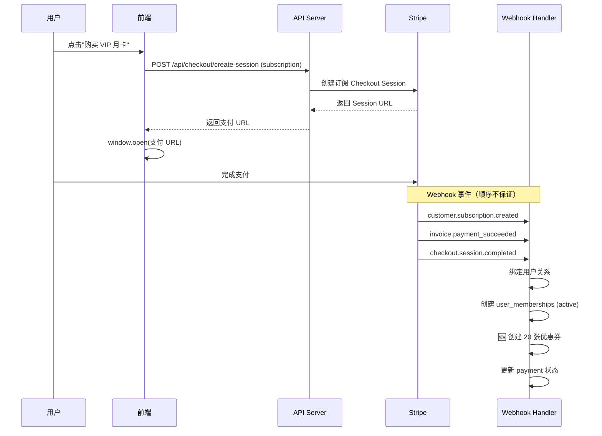
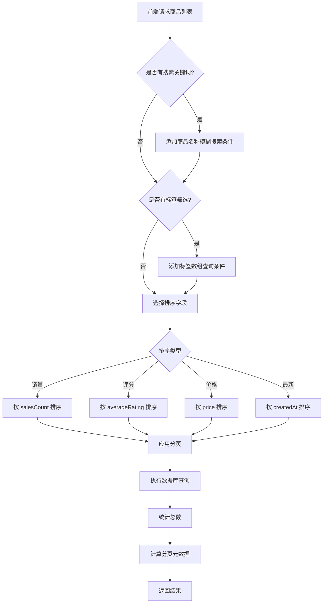
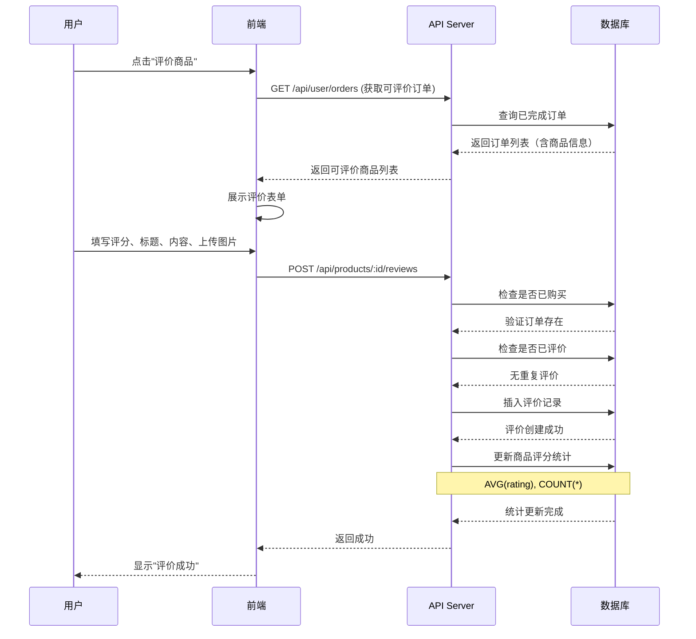
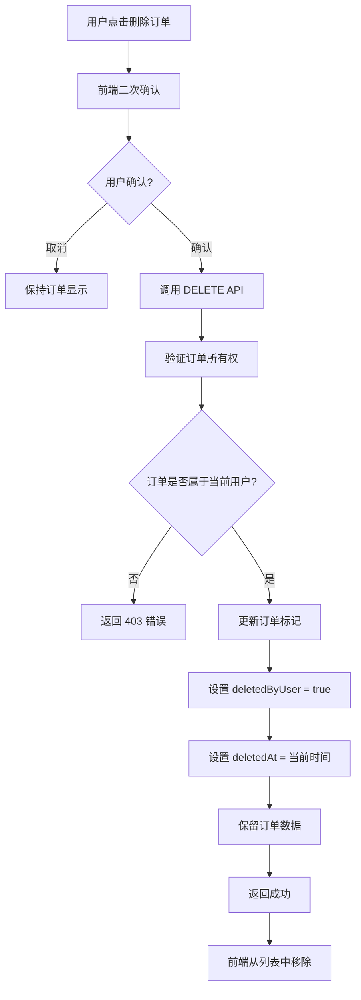
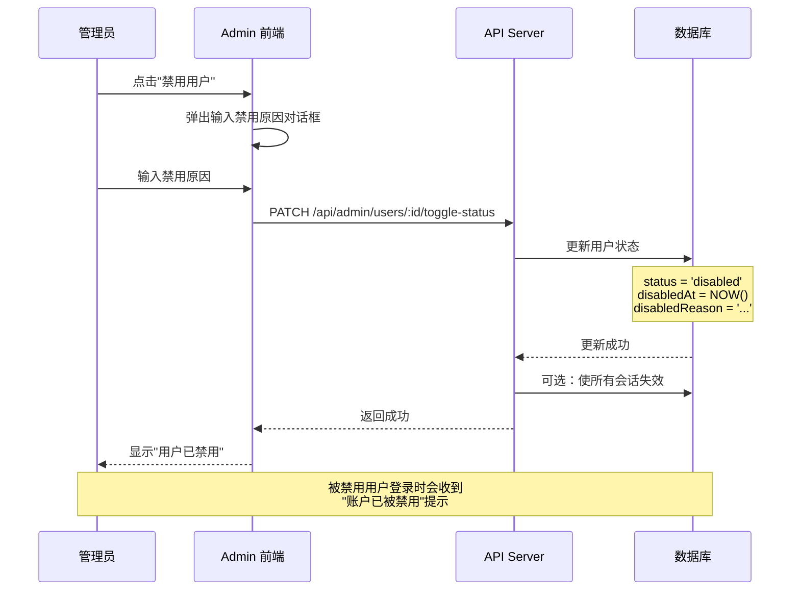
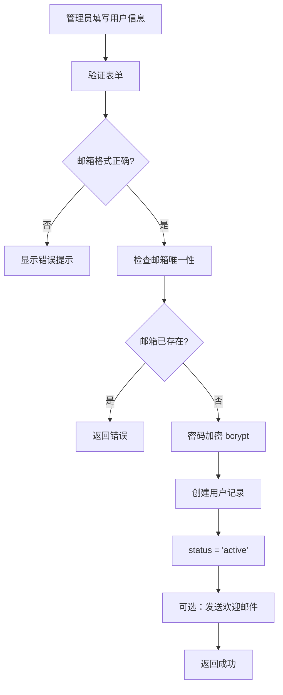

# Dev-2: Stripe 支付功能开发文档

> **文档版本**: v1.2  
> **创建日期**: 2026-01-05  
> **最后更新**: 2026-01-05  
> **依赖**: [dev-doc/devlopment.md](./devlopment.md) - 基础商城系统

---

## 1. 功能概述

本文档描述 Stripe 在线支付功能的接入，作为基础商城系统的增量功能模块。

### 1.1 核心功能

- ✅ 购物车商品单次支付（Stripe Checkout，新窗口跳转）
- ✅ 会员订阅功能（月卡/年卡等周期性支付）
- ✅ 会员优惠券系统（每月 20 张 9 折优惠券）
- ✅ Webhook 事件处理（支付状态实时同步）
- ✅ 支付状态轮询查询
- ✅ 商品 Stripe 同步（自动创建 Product、Price、Payment Link）
- ✅ 商品上下架管理
- ✅ 退款处理

### 1.2 技术选型

| 模块           | 技术方案                | 说明                     |
| -------------- | ----------------------- | ------------------------ |
| **支付流程**   | Stripe Checkout Session | 托管支付页面，新窗口打开 |
| **服务端 SDK** | `stripe` (Node.js)      | 官方 SDK                 |
| **签名验证**   | Webhook Signature       | 防止伪造请求             |
| **幂等性**     | Event ID 去重           | 防止重复处理             |
| **会员优惠**   | Stripe Coupon API       | 用户手动添加优惠券码     |

---

## 2. 核心设计决策

### 2.1 会员优惠券策略

- **发放方式**: 会员订阅成功后，系统自动在 Stripe 创建 30 张专属优惠券
- **优惠力度**: 每张优惠券为 9 折优惠（10% OFF）
- **发放周期**: 每月发放一次，订阅续费时自动发放新优惠券
- **有效期**: 每张优惠券有效期 30 天（从创建日期起算）
- **使用限制**:
  - 优惠券只能会员本人使用（通过 Stripe Customer ID 限制）
  - 一张优惠券只能使用一次
- **应用方式**: 用户在 Stripe 托管支付页面自行添加优惠券码
- **系统职责**:
  1. 订阅成功时创建优惠券
  2. 记录优惠券状态
  3. 处理优惠券过期逻辑
  4. 展示用户可用优惠券列表

### 2.2 商品类型划分

使用 `product_type` 字段区分两种商品类型：

- **普通商品** (`one_time`): 一次性支付，可加入购物车批量结算，可使用优惠券
- **会员卡商品** (`subscription`): 订阅支付，周期扣款，独立购买，不可使用优惠券

### 2.3 支付流程

采用 **Stripe Checkout Session**（托管支付页面）：

- 新窗口打开支付页面
- 用户在支付页面自行输入优惠券码
- 支付完成后跳转回成功页面
- 前端轮询查询支付结果

---

## 3. 数据库表设计

### 3.1 调整现有 `products` 表

**新增字段**:

```typescript
export const productTypeEnum = pgEnum("product_type", [
  "one_time",      // 一次性支付（普通商品）
  "subscription",  // 订阅支付（会员卡）
]);

// products 表新增字段
productType: productTypeEnum("product_type").default("one_time").notNull(),
stripeProductId: text("stripe_product_id"),
stripePriceId: text("stripe_price_id"),
stripePaymentLinkUrl: text("stripe_payment_link_url"),
isActive: boolean("is_active").default(true).notNull(),

// 新增：标签、销量、评分相关（v1.2）
tags: text("tags").array(), // 商品标签数组
salesCount: integer("sales_count").default(0).notNull(), // 销量
averageRating: decimal("average_rating", { precision: 3, scale: 2 }).default("0").notNull(), // 平均评分
reviewCount: integer("review_count").default(0).notNull(), // 评价数量
```

### 3.2 新增表

#### A. user_stripe_customers (用户-Stripe 客户映射)

```typescript
export const userStripeCustomers = pgTable("user_stripe_customers", {
  id: serial("id").primaryKey(),
  userId: text("user_id")
    .notNull()
    .unique()
    .references(() => user.id, { onDelete: "cascade" }),
  stripeCustomerId: text("stripe_customer_id").notNull().unique(),
  email: text("email").notNull(),
  createdAt: timestamp("created_at").defaultNow().notNull(),
  updatedAt: timestamp("updated_at").defaultNow().notNull(),
});
```

**作用**: 建立本地用户与 Stripe Customer 的一对一映射关系。

#### B. payments (支付记录)

```typescript
export const paymentStatusEnum = pgEnum("payment_status", [
  "pending",
  "processing",
  "succeeded",
  "failed",
  "refunded",
  "canceled",
]);

export const paymentTypeEnum = pgEnum("payment_type", [
  "one_time",
  "subscription",
]);

export const payments = pgTable("payments", {
  id: serial("id").primaryKey(),
  userId: text("user_id").references(() => user.id, { onDelete: "set null" }),

  // Stripe 相关 ID
  stripePaymentIntentId: text("stripe_payment_intent_id"),
  stripeInvoiceId: text("stripe_invoice_id"),
  stripeSubscriptionId: text("stripe_subscription_id"),
  stripeCheckoutSessionId: text("stripe_checkout_session_id").unique(),

  // 支付信息
  paymentType: paymentTypeEnum("payment_type").notNull(),
  amount: decimal("amount", { precision: 10, scale: 2 }).notNull(),
  currency: text("currency").default("hkd").notNull(),
  status: paymentStatusEnum("status").default("pending").notNull(),

  orderId: integer("order_id").references(() => orders.id, {
    onDelete: "set null",
  }),
  metadata: text("metadata"), // JSON 格式

  createdAt: timestamp("created_at").defaultNow().notNull(),
  updatedAt: timestamp("updated_at").defaultNow().notNull(),
});
```

#### C. user_memberships (用户会员订阅)

```typescript
export const membershipStatusEnum = pgEnum("membership_status", [
  "active",
  "canceled",
  "expired",
  "pending",
]);

export const userMemberships = pgTable("user_memberships", {
  id: serial("id").primaryKey(),
  userId: text("user_id")
    .notNull()
    .references(() => user.id, { onDelete: "cascade" }),

  // Stripe 订阅信息
  stripeSubscriptionId: text("stripe_subscription_id").notNull().unique(),
  stripeCustomerId: text("stripe_customer_id").notNull(),
  stripePriceId: text("stripe_price_id").notNull(),

  // 订阅状态
  status: membershipStatusEnum("status").default("pending").notNull(),
  currentPeriodStart: timestamp("current_period_start"),
  currentPeriodEnd: timestamp("current_period_end"),
  cancelAt: timestamp("cancel_at"),
  canceledAt: timestamp("canceled_at"),
  endedAt: timestamp("ended_at"),

  createdAt: timestamp("created_at").defaultNow().notNull(),
  updatedAt: timestamp("updated_at").defaultNow().notNull(),
});
```

**索引**:

- `userId` 索引
- `stripeSubscriptionId` 唯一索引

#### D. stripe_webhook_logs (Webhook 事件日志)

```typescript
export const stripeWebhookLogs = pgTable("stripe_webhook_logs", {
  id: serial("id").primaryKey(),
  eventId: text("event_id").notNull().unique(),
  eventType: text("event_type").notNull(),
  payload: text("payload").notNull(), // 完整 JSON payload

  // 处理状态
  processed: boolean("processed").default(false).notNull(),
  processedAt: timestamp("processed_at"),
  errorMessage: text("error_message"),

  createdAt: timestamp("created_at").defaultNow().notNull(),
});
```

**作用**:

- 防止重复处理（幂等性）
- 支持事件回溯
- 错误排查

#### E. user_coupons (用户优惠券) ⭐️

```typescript
export const couponStatusEnum = pgEnum("coupon_status", [
  "available",
  "used",
  "expired",
  "revoked",
]);

export const userCoupons = pgTable("user_coupons", {
  id: serial("id").primaryKey(),
  userId: text("user_id")
    .notNull()
    .references(() => user.id, { onDelete: "cascade" }),

  // Stripe 优惠券信息
  stripeCouponId: text("stripe_coupon_id").notNull().unique(),
  couponCode: text("coupon_code").notNull(),
  stripeCustomerId: text("stripe_customer_id").notNull(),

  // 优惠信息
  percentOff: integer("percent_off").default(10).notNull(), // 10% = 9折
  duration: text("duration").default("once").notNull(),

  // 状态管理
  status: couponStatusEnum("status").default("available").notNull(),
  usedAt: timestamp("used_at"),
  expiresAt: timestamp("expires_at").notNull(), // 创建后30天

  // 关联信息
  membershipId: integer("membership_id").references(() => userMemberships.id, {
    onDelete: "set null",
  }),
  paymentId: integer("payment_id").references(() => payments.id, {
    onDelete: "set null",
  }),

  createdAt: timestamp("created_at").defaultNow().notNull(),
  updatedAt: timestamp("updated_at").defaultNow().notNull(),
});
```

**索引**:

- `userId` + `status` + `expiresAt` 复合索引
- `stripeCouponId` 唯一索引

#### F. product_tags (商品标签) 🆕

```typescript
export const productTags = pgTable("product_tags", {
  id: serial("id").primaryKey(),
  name: text("name").notNull().unique(), // 标签名称，唯一
  slug: text("slug").notNull().unique(), // URL 友好的标识符
  description: text("description"), // 标签描述
  color: text("color").default("#3b82f6"), // 标签颜色（用于前端展示）

  createdAt: timestamp("created_at").defaultNow().notNull(),
  updatedAt: timestamp("updated_at").defaultNow().notNull(),
});
```

**索引**:

- `name` 唯一索引
- `slug` 唯一索引

#### G. product_reviews (商品评价) 🆕

```typescript
export const reviewStatusEnum = pgEnum("review_status", [
  "published", // 已发布
  "hidden", // 已隐藏（管理员操作）
  "deleted", // 用户删除
]);

export const productReviews = pgTable("product_reviews", {
  id: serial("id").primaryKey(),
  userId: text("user_id")
    .notNull()
    .references(() => user.id, { onDelete: "cascade" }),
  productId: integer("product_id")
    .notNull()
    .references(() => products.id, { onDelete: "cascade" }),
  orderId: integer("order_id").references(() => orders.id, {
    onDelete: "set null",
  }), // 关联订单，证明已购买

  // 评价内容
  rating: integer("rating").notNull(), // 1-5 星
  title: text("title"), // 评价标题（可选）
  content: text("content"), // 评价内容（可选）
  images: text("images").array(), // 评价图片 URL 数组

  // 状态管理
  status: reviewStatusEnum("status").default("published").notNull(),

  createdAt: timestamp("created_at").defaultNow().notNull(),
  updatedAt: timestamp("updated_at").defaultNow().notNull(),
});
```

**索引**:

- `orderId` + `productId` 复合唯一索引（保证同一订单中的商品只能评价一次）
- `productId` + `status` 复合索引（用于查询已发布评价）
- `userId` 索引

**约束**:

- 同一订单中的同一商品只能评价一次（数据库唯一索引 + 应用层控制）
- 允许用户多次购买同一商品，每次购买（订单）可分别评价
- rating 必须在 1-5 之间（应用层校验）

#### H. user 表扩展字段 🆕

```typescript
// user 表新增字段
status: userStatusEnum("status").default("active").notNull(), // 用户状态
disabledAt: timestamp("disabled_at"), // 禁用时间
disabledReason: text("disabled_reason"), // 禁用原因
```

**新增枚举**:

```typescript
export const userStatusEnum = pgEnum("user_status", [
  "active", // 正常
  "disabled", // 已禁用
  "deleted", // 已删除
]);
```

#### I. orders 表扩展字段 🆕

```typescript
// orders 表新增字段
deletedByUser: boolean("deleted_by_user").default(false).notNull(), // 用户软删除标记
deletedAt: timestamp("deleted_at"), // 删除时间
```

**作用**: 实现订单软删除功能，用户删除订单后不真实删除数据库记录。

---

## 4. API 接口设计

### 4.1 创建支付会话

**POST** `/api/checkout/create-session`

**请求体**:

```typescript
// 单次支付
{ type: "one_time", cartId: 123, successUrl, cancelUrl }

// 订阅支付
{ type: "subscription", priceId: "price_xxx", successUrl, cancelUrl }
```

**响应**:

```json
{
  "sessionId": "cs_test_xxxxx",
  "url": "https://checkout.stripe.com/c/pay/cs_test_xxxxx"
}
```

**核心逻辑**:

1. 获取或创建 Stripe Customer
2. 创建 Checkout Session（使用 `client_reference_id` 传递 userId）
3. 创建本地 payment 记录（状态 pending）

---

### 4.2 Webhook 事件处理

**POST** `/api/webhook/stripe`

**监听事件**:

| 事件类型                        | 说明         | 处理逻辑                           |
| ------------------------------- | ------------ | ---------------------------------- |
| `checkout.session.completed`    | 支付完成     | 创建订单（单次）/ 绑定用户（订阅） |
| `customer.subscription.created` | 订阅创建     | 延迟处理，等待用户绑定             |
| `invoice.payment_succeeded`     | 订阅付款成功 | 更新 payment 状态，发放优惠券      |
| `customer.subscription.updated` | 订阅更新     | 更新 membership 状态               |
| `customer.subscription.deleted` | 订阅删除     | 更新为 expired                     |
| `charge.refunded`               | 退款         | 更新 payment 状态                  |
| `coupon.updated`                | 优惠券更新   | 更新优惠券使用状态                 |

**关键处理流程**:

```typescript
1. 验证签名 (stripe.webhooks.constructEvent)
2. 检查事件是否已处理（幂等性）
3. 记录到 stripe_webhook_logs
4. 根据事件类型分发处理
5. 标记为已处理
```

---

### 4.3 轮询查询支付状态

**GET** `/api/payment/check-status?sessionId=cs_test_xxxxx`

**响应**:

```json
{
  "status": "succeeded",
  "orderId": 123,
  "amount": 288.0,
  "type": "one_time"
}
```

---

### 4.4 获取用户优惠券

**GET** `/api/user/coupons`

**响应**:

```json
{
  "coupons": [
    {
      "id": 1,
      "couponCode": "coupon_xxxxx",
      "percentOff": 10,
      "status": "available",
      "expiresAt": "2026-02-05T00:00:00Z"
    }
  ],
  "total": 30,
  "available": 28,
  "used": 2,
  "expired": 0
}
```

---

### 4.5 商品管理增强 🆕

#### A. 商品标签管理

**GET** `/api/admin/tags` - 获取所有标签

**响应**:

```json
{
  "tags": [
    {
      "id": 1,
      "name": "热门",
      "slug": "hot",
      "description": "热门商品",
      "color": "#ef4444"
    }
  ]
}
```

**POST** `/api/admin/tags` - 创建标签

**请求体**:

```json
{
  "name": "热门",
  "slug": "hot",
  "description": "热门商品",
  "color": "#ef4444"
}
```

**PATCH** `/api/admin/tags/:id` - 更新标签
**DELETE** `/api/admin/tags/:id` - 删除标签（检查是否被商品使用）

#### B. 商品 CRUD 增强

**POST** `/api/admin/products` - 创建商品并同步 Stripe

**请求体**:

```json
{
  "name": "商品名称",
  "description": "商品描述",
  "price": "288.88",
  "imageUrl": "https://...",
  "productType": "one_time",
  "tags": ["热门", "新品"], // 标签数组
  "isActive": true
}
```

**PATCH** `/api/admin/products/:id` - 更新商品（包括标签）

**PATCH** `/api/admin/products/:id/toggle-active` - 商品上下架

---

### 4.6 商品列表增强 🆕

**GET** `/api/products`

**查询参数**:

```typescript
{
  search?: string,        // 商品名称模糊搜索
  tags?: string[],        // 标签筛选（多选）
  page?: number,          // 页码，默认 1
  pageSize?: number,      // 每页数量，默认 12
  sortBy?: "sales" | "rating" | "createdAt" | "price", // 排序字段
  sortOrder?: "asc" | "desc", // 排序方向，默认 desc
}
```

**响应**:

```json
{
  "products": [
    {
      "id": 1,
      "name": "商品名称",
      "price": "288.88",
      "imageUrl": "https://...",
      "tags": ["热门", "新品"],
      "salesCount": 1520,
      "averageRating": "4.85",
      "reviewCount": 328
    }
  ],
  "pagination": {
    "page": 1,
    "pageSize": 12,
    "total": 150,
    "totalPages": 13,
    "hasNext": true,
    "hasPrev": false
  }
}
```

**核心逻辑**:

```typescript
// 构建查询条件
const conditions = [eq(products.isActive, true)];

// 商品名称模糊搜索
if (search) {
  conditions.push(ilike(products.name, `%${search}%`));
}

// 标签筛选（PostgreSQL 数组查询）
if (tags?.length > 0) {
  conditions.push(arrayContains(products.tags, tags));
}

// 排序
const orderByMap = {
  sales: products.salesCount,
  rating: products.averageRating,
  createdAt: products.createdAt,
  price: products.price,
};

// 分页查询
const result = await db
  .select()
  .from(products)
  .where(and(...conditions))
  .orderBy(desc(orderByMap[sortBy]))
  .limit(pageSize)
  .offset((page - 1) * pageSize);
```

---

### 4.7 用户管理 API 🆕

#### A. 用户列表（Admin）

**GET** `/api/admin/users`

**查询参数**:

```typescript
{
  search?: string,        // 用户名、邮箱模糊搜索
  status?: "active" | "disabled" | "deleted", // 状态筛选
  page?: number,
  pageSize?: number,
  sortBy?: "createdAt" | "email", // 排序字段
  sortOrder?: "asc" | "desc",
}
```

**响应**:

```json
{
  "users": [
    {
      "id": "user_123",
      "name": "张三",
      "email": "zhang@example.com",
      "status": "active",
      "createdAt": "2026-01-01T00:00:00Z",
      "membershipStatus": "active"
    }
  ],
  "pagination": {
    "page": 1,
    "pageSize": 20,
    "total": 500,
    "totalPages": 25
  }
}
```

#### B. 创建用户（Admin）

**POST** `/api/admin/users`

**请求体**:

```json
{
  "name": "张三",
  "email": "zhang@example.com",
  "password": "secure_password"
}
```

#### C. 禁用/启用用户

**PATCH** `/api/admin/users/:id/toggle-status`

**请求体**:

```json
{
  "status": "disabled",
  "reason": "违反社区规则"
}
```

**核心逻辑**:

```typescript
// 禁用用户
await db.update(user).set({
  status: "disabled",
  disabledAt: new Date(),
  disabledReason: reason,
});

// 启用用户
await db.update(user).set({
  status: "active",
  disabledAt: null,
  disabledReason: null,
});
```

#### D. 删除用户（Admin）

**DELETE** `/api/admin/users/:id`

**核心逻辑**:

```typescript
// 软删除
await db.update(user).set({
  status: "deleted",
  disabledAt: new Date(),
});

// 或硬删除（根据级联规则会删除关联数据）
await db.delete(user).where(eq(user.id, userId));
```

---

### 4.8 订单管理增强 🆕

#### A. 用户删除订单（软删除）

**DELETE** `/api/user/orders/:id`

**核心逻辑**:

```typescript
// 验证订单所有权
const order = await db.query.orders.findFirst({
  where: and(eq(orders.id, orderId), eq(orders.userId, currentUserId)),
});

if (!order) {
  throw new Error("订单不存在或无权删除");
}

// 软删除
await db
  .update(orders)
  .set({
    deletedByUser: true,
    deletedAt: new Date(),
  })
  .where(eq(orders.id, orderId));
```

#### B. 用户订单列表

**GET** `/api/user/orders`

**核心逻辑**:

```typescript
// 默认不显示已删除订单
const userOrders = await db.query.orders.findMany({
  where: and(eq(orders.userId, currentUserId), eq(orders.deletedByUser, false)),
  orderBy: desc(orders.createdAt),
});
```

---

### 4.9 商品评价 API 🆕

#### A. 创建评价

**POST** `/api/products/:productId/reviews`

**请求体**:

```json
{
  "orderId": 123,
  "rating": 5,
  "title": "非常满意",
  "content": "质量很好，物流快速",
  "images": ["https://..."]
}
```

**核心逻辑**:

```typescript
// 1. 验证是否已购买
const order = await db.query.orders.findFirst({
  where: and(
    eq(orders.id, orderId),
    eq(orders.userId, currentUserId),
    eq(orders.status, "completed")
  ),
  with: {
    orderItems: {
      where: eq(orderItems.productId, productId),
    },
  },
});

if (!order || order.orderItems.length === 0) {
  throw new Error("只能评价已购买的商品");
}

// 2. 检查该订单中此商品是否已评价
const existingReview = await db.query.productReviews.findFirst({
  where: and(
    eq(productReviews.orderId, orderId),
    eq(productReviews.productId, productId)
  ),
});

if (existingReview) {
  throw new Error("该订单中的此商品已评价过");
}

// 3. 创建评价
const review = await db.insert(productReviews).values({
  userId: currentUserId,
  productId,
  orderId,
  rating,
  title,
  content,
  images,
  status: "published",
});

// 4. 更新商品评分统计
await updateProductRating(productId);
```

#### B. 获取商品评价列表

**GET** `/api/products/:productId/reviews`

**查询参数**:

```typescript
{
  page?: number,
  pageSize?: number,
  sortBy?: "createdAt" | "rating",
}
```

**响应**:

```json
{
  "reviews": [
    {
      "id": 1,
      "user": {
        "id": "user_123",
        "name": "张三"
      },
      "rating": 5,
      "title": "非常满意",
      "content": "质量很好",
      "images": [],
      "createdAt": "2026-01-05T00:00:00Z"
    }
  ],
  "pagination": {
    "page": 1,
    "pageSize": 10,
    "total": 328
  },
  "stats": {
    "averageRating": "4.85",
    "totalReviews": 328,
    "ratingDistribution": {
      "5": 280,
      "4": 38,
      "3": 8,
      "2": 1,
      "1": 1
    }
  }
}
```

#### C. 更新商品评分统计（内部函数）

```typescript
async function updateProductRating(productId: number) {
  // 计算平均评分和评价数量
  const stats = await db
    .select({
      avgRating: sql<number>`AVG(${productReviews.rating})`,
      count: sql<number>`COUNT(*)`,
    })
    .from(productReviews)
    .where(
      and(
        eq(productReviews.productId, productId),
        eq(productReviews.status, "published")
      )
    );

  // 更新商品表
  await db
    .update(products)
    .set({
      averageRating: stats[0].avgRating.toFixed(2),
      reviewCount: stats[0].count,
    })
    .where(eq(products.id, productId));
}
```

---

### 4.10 已有 API 保留

**POST** `/api/checkout/create-session` - 创建支付会话
**POST** `/api/webhook/stripe` - Webhook 事件处理
**GET** `/api/payment/check-status` - 轮询查询支付状态
**GET** `/api/user/coupons` - 获取用户优惠券

---

## 5. 核心业务流程

### 5.1 会员订阅支付流程



### 5.2 会员优惠券发放流程

**触发时机**:

- 订阅支付成功 (`invoice.payment_succeeded`)
- 订阅续费成功

**处理逻辑**:

```typescript
async function createMembershipCoupons(userId, membershipId) {
  const customer = await getUserStripeCustomer(userId);
  const coupons = [];

  for (let i = 0; i < 30; i++) {
    // 1. 在 Stripe 创建优惠券
    const stripeCoupon = await stripe.coupons.create({
      percent_off: 10,
      duration: "once",
      max_redemptions: 1,
      redeem_by: Date.now() + 30 * 24 * 60 * 60, // 30天后
      applies_to: { products: getOneTimeProductIds() },
    });

    // 2. 记录到本地数据库
    const coupon = await db.insert(userCoupons).values({
      userId,
      stripeCouponId: stripeCoupon.id,
      couponCode: stripeCoupon.id,
      stripeCustomerId: customer.id,
      expiresAt: new Date(Date.now() + 30 * 24 * 60 * 60 * 1000),
      membershipId,
    });

    coupons.push(coupon);
  }

  return coupons;
}
```

### 5.3 优惠券使用跟踪

**Webhook**: `coupon.updated`

```typescript
async function handleCouponUpdated(coupon: Stripe.Coupon) {
  const localCoupon = await findCouponByStripeId(coupon.id);

  if (coupon.times_redeemed > 0) {
    await db
      .update(userCoupons)
      .set({ status: "used", usedAt: new Date() })
      .where(eq(userCoupons.id, localCoupon.id));
  }
}
```

在 `checkout.session.completed` 中关联支付记录:

```typescript
if (session.total_details?.amount_discount > 0) {
  const appliedCoupon = session.discounts?.[0]?.coupon;
  await updateCouponPayment(appliedCoupon.id, payment.id);
}
```

### 5.4 优惠券过期处理

**定时任务** (每日执行):

```typescript
async function expireOldCoupons() {
  const now = new Date();

  const expired = await db
    .update(userCoupons)
    .set({ status: "expired" })
    .where(
      and(eq(userCoupons.status, "available"), lt(userCoupons.expiresAt, now))
    )
    .returning();

  // 可选：删除 Stripe 中的优惠券
  for (const coupon of expired) {
    await stripe.coupons.del(coupon.stripeCouponId);
  }
}
```

### 5.5 商品列表查询流程 🆕



**关键实现点**:

1. **搜索性能优化**: 在 `products.name` 字段上创建 GIN 索引（全文搜索）
2. **标签筛选**: 使用 PostgreSQL 数组操作符 `@>` 或 `&&`
3. **动态排序**: 根据前端参数动态构建 `ORDER BY` 子句
4. **分页**: 使用 `LIMIT` 和 `OFFSET`，考虑使用游标分页优化大数据集

### 5.6 商品评价流程 🆕



**业务规则**:

1. ✅ **已购买验证**: 只能评价订单状态为 `completed` 的商品
2. ✅ **唯一性约束**: 同一订单中的同一商品只能评价一次（允许多次购买多次评价）
3. ✅ **评分范围**: 1-5 星，步长为 1
4. ✅ **实时统计**: 每次评价后立即更新商品的平均评分和评价数量
5. ✅ **图片上传**: 支持多张图片（建议限制 5 张以内）

### 5.7 订单软删除流程 🆕



**软删除优势**:

- ✅ 数据可恢复（管理员可查看）
- ✅ 保留订单历史用于数据分析
- ✅ 支持退款等后续操作
- ✅ 符合法规要求（如电子商务法）

### 5.8 用户管理流程（Admin） 🆕

#### A. 禁用用户流程



#### B. 创建用户流程



### 5.9 销量和评分更新机制 🆕

#### A. 销量更新（订单完成时）

```typescript
// 在订单状态变更为 'completed' 时触发
async function updateProductSales(orderId: number) {
  const order = await db.query.orders.findFirst({
    where: eq(orders.id, orderId),
    with: { orderItems: true },
  });

  // 批量更新所有商品的销量
  for (const item of order.orderItems) {
    await db
      .update(products)
      .set({
        salesCount: sql`${products.salesCount} + ${item.quantity}`,
      })
      .where(eq(products.id, item.productId));
  }
}

// Webhook 处理中调用
async function handleCheckoutSessionCompleted(session) {
  // ... 创建订单
  await updateProductSales(order.id);
}
```

#### B. 评分更新（触发时机）

- 用户创建评价
- 用户修改评价（如支持）
- 管理员隐藏/显示评价

```typescript
// 更新逻辑（已在 4.9.C 中展示）
// 使用 SQL 聚合函数保证数据一致性
```

---

## 6. Webhook 乱序处理方案

### 6.1 问题描述

订阅支付的 Webhook 事件顺序不保证：

1. `customer.subscription.created` - 无 user_id
2. `invoice.payment_succeeded` - 无 user_id
3. `checkout.session.completed` - 有 `client_reference_id`

### 6.2 解决方案：延迟处理 + 事件回溯

1. **记录所有事件** 到 `stripe_webhook_logs`，标记 `processed=false`
2. **处理 `checkout.session.completed`**:
   - 提取 `client_reference_id` → `userId`
   - 创建 `user_stripe_customers` 映射
   - **回溯处理**未处理的相关事件
3. **权益发放条件**:
   - ✅ 支付成功
   - ✅ 用户关系已绑定
   - ✅ 订阅状态 active

---

## 7. 安全注意事项

### 7.1 Webhook 签名验证

```typescript
const sig = headers().get("stripe-signature");
const event = stripe.webhooks.constructEvent(body, sig, webhookSecret);
```

### 7.2 幂等性保证

```typescript
const existing = await findEventById(event.id);
if (existing?.processed) return { received: true };
```

### 7.3 金额处理

#### 7.3.1 精度问题

JavaScript 中直接使用 `Number` 类型进行浮点数运算会导致精度丢失：

```javascript
// ❌ 错误示例
0.1 + 0.2 === 0.3; // false，实际结果 0.30000000000000004
288 * 0.9; // 259.20000000000005
parseFloat("288.88") * 100; // 28887.999999999996
```

在金融场景中，这类精度问题可能导致严重后果。

#### 7.3.2 解决方案：使用 decimal.js

**推荐使用 [decimal.js](https://github.com/MikeMcl/decimal.js/)** 库进行所有金额计算：

```bash
# 安装依赖
pnpm add decimal.js
```

**核心优势**：

- ✅ 任意精度的十进制算术运算
- ✅ 轻量级（压缩后约 32KB）
- ✅ 内置 TypeScript 类型定义
- ✅ 被 Stripe、Shopify 等金融项目广泛使用

#### 7.3.3 工具函数实现示例

创建统一的金额计算工具模块 `lib/currency.ts`：

```typescript
import Decimal from "decimal.js";

// 配置精度（货币通常保留 2 位小数）
Decimal.set({ precision: 20, rounding: Decimal.ROUND_HALF_UP });

/**
 * 转换为 Decimal 类型
 */
export function toDecimal(value: string | number | Decimal): Decimal {
  return new Decimal(value);
}

/**
 * 格式化为货币字符串
 */
export function formatCurrency(
  value: string | number | Decimal,
  currency: string = "CNY",
  decimals: number = 2
): string {
  const amount = toDecimal(value).toFixed(decimals);
  const symbol = currency === "CNY" ? "¥" : currency === "HKD" ? "HK$" : "$";
  return `${symbol}${amount}`;
}

/**
 * 转换为 Stripe 金额（最小货币单位）
 * HKD/CNY: 288.88 → 28888
 */
export function toStripeAmount(amount: string | number | Decimal): number {
  return toDecimal(amount).times(100).toNumber();
}

/**
 * 从 Stripe 金额转换回标准金额
 * 28888 → 288.88
 */
export function fromStripeAmount(stripeAmount: number): Decimal {
  return toDecimal(stripeAmount).dividedBy(100);
}

/**
 * 计算商品小计（单价 × 数量）
 */
export function calculateItemTotal(
  price: string | number,
  quantity: number
): Decimal {
  return toDecimal(price).times(quantity);
}

/**
 * 计算购物车总价
 */
export function calculateCartTotal(
  items: Array<{ price: string; quantity: number }>
): Decimal {
  return items.reduce(
    (sum, item) => sum.plus(calculateItemTotal(item.price, item.quantity)),
    new Decimal(0)
  );
}

/**
 * 应用折扣（百分比）
 */
export function applyDiscount(
  amount: string | number | Decimal,
  percentOff: number
): Decimal {
  const multiplier = toDecimal(100).minus(percentOff).dividedBy(100);
  return toDecimal(amount).times(multiplier);
}
```

#### 7.3.4 使用示例

**页面中计算订单总价**：

```typescript
import { calculateCartTotal, formatCurrency } from "@/lib/currency";

// ✅ 正确示例
const total = calculateCartTotal([
  { price: "288.88", quantity: 2 },
  { price: "99.99", quantity: 1 },
]);
const displayTotal = formatCurrency(total); // "¥777.75"
```

**Stripe Checkout Session 创建**：

```typescript
import { toStripeAmount } from "@/lib/currency";

const session = await stripe.checkout.sessions.create({
  line_items: [
    {
      price_data: {
        currency: "hkd",
        product_data: { name: "商品名称" },
        unit_amount: toStripeAmount(288.88), // 28888
      },
      quantity: 1,
    },
  ],
  mode: "payment",
});
```

**处理 Webhook 金额**：

```typescript
import { fromStripeAmount, formatCurrency } from "@/lib/currency";

async function handlePaymentSuccess(event: Stripe.Event) {
  const paymentIntent = event.data.object as Stripe.PaymentIntent;
  const amount = fromStripeAmount(paymentIntent.amount); // Decimal

  console.log(`收到支付：${formatCurrency(amount)}`);

  // 存储到数据库（转为字符串保留精度）
  await db.insert(payments).values({
    amount: amount.toString(), // "288.88"
    currency: paymentIntent.currency,
  });
}
```

**优惠券折扣计算**：

```typescript
import { applyDiscount, formatCurrency } from "@/lib/currency";

const originalPrice = 288.88;
const discountedPrice = applyDiscount(originalPrice, 10); // 9折
console.log(formatCurrency(discountedPrice)); // "¥259.99"
```

#### 7.3.5 数据库存储建议

```typescript
// schema.ts
export const products = pgTable("products", {
  // ✅ 使用 text 类型存储，避免精度丢失
  price: text("price").notNull(),

  // ❌ 不推荐使用 decimal/numeric，Drizzle ORM 会转为 string
  // price: decimal('price', { precision: 10, scale: 2 }),
});

// 读取时转换
const product = await db.query.products.findFirst();
const price = toDecimal(product.price);
```

#### 7.3.6 最佳实践总结

| 场景            | 推荐做法                | 避免做法                          |
| --------------- | ----------------------- | --------------------------------- |
| **金额计算**    | 使用 `Decimal` 类型     | 直接使用 `Number` 或 `parseFloat` |
| **数据库存储**  | 存储为 `text` 类型      | 依赖数据库 decimal 类型           |
| **前端展示**    | 使用 `formatCurrency()` | 手动拼接字符串                    |
| **Stripe 转换** | 使用 `toStripeAmount()` | `Math.round(amount * 100)`        |
| **中间计算**    | 保持 `Decimal` 类型     | 频繁转换 `toString()`             |

> [!WARNING] > **关键原则**：金额在计算过程中始终使用 `Decimal` 类型，仅在以下情况转换：
>
> 1. **展示给用户**：转为格式化字符串
> 2. **存储到数据库**：转为字符串（`toString()`）
> 3. **传递给 Stripe**：转为整数（`toStripeAmount()`）

---

## 8. 前端集成要点

### 8.1 会员中心页面

- 展示所有优惠券（可用/已使用/已过期）
- 过期时间倒计时
- 复制优惠券码功能

### 8.2 结算页面

- 移除自动应用折扣逻辑
- 提示用户可使用优惠券
- 显示可用优惠券数量
- 提供"查看我的优惠券"链接

### 8.3 Stripe Checkout 页面

- 用户手动输入优惠券码
- Stripe 自动验证有效性
- 显示折扣后价格

### 8.4 商品列表页面增强 🆕

**新增功能组件**:

#### A. 搜索框组件 (`ProductSearchBar`)

```typescript
interface ProductSearchBarProps {
  onSearch: (keyword: string) => void;
  defaultValue?: string;
}
```

**功能**:

- 实时搜索（防抖 500ms）
- 搜索历史记录（localStorage）
- 清空按钮

#### B. 标签筛选组件 (`TagFilter`)

```typescript
interface TagFilterProps {
  tags: Tag[]; // 所有可用标签
  selectedTags: string[]; // 已选中标签
  onChange: (tags: string[]) => void;
}
```

**UI 设计**:

- 横向滚动标签列表
- 多选（Checkbox 样式）
- 显示选中数量徽章
- "清除筛选"按钮

#### C. 排序选择器 (`SortSelector`)

```typescript
interface SortSelectorProps {
  value: SortOption;
  onChange: (option: SortOption) => void;
}

type SortOption =
  | { field: "sales"; order: "desc" } // 销量最高
  | { field: "rating"; order: "desc" } // 好评优先
  | { field: "createdAt"; order: "desc" } // 最新上架
  | { field: "price"; order: "asc" } // 价格从低到高
  | { field: "price"; order: "desc" }; // 价格从高到低
```

**UI 设计**:

- 下拉选择器或标签组
- 当前排序高亮显示
- 默认为"销量最高"

#### D. 分页组件 (`Pagination`)

```typescript
interface PaginationProps {
  page: number;
  pageSize: number;
  total: number;
  onPageChange: (page: number) => void;
  mode?: "pagination" | "infinite-scroll"; // 分页模式或无限滚动
}
```

**两种模式**:

1. **传统分页**:

   - 页码按钮（最多显示 7 个）
   - 上一页/下一页
   - 跳转到指定页

2. **无限滚动**（推荐移动端）:
   - 滚动到底部自动加载
   - 加载指示器
   - "加载更多"按钮（预加载失败时）

#### E. 商品卡片增强 (`ProductCard`)

**新增显示信息**:

```typescript
interface ProductCardProps {
  product: {
    id: number;
    name: string;
    price: string;
    imageUrl: string;
    tags: string[]; // 🆕 标签
    salesCount: number; // 🆕 销量
    averageRating: string; // 🆕 平均评分
    reviewCount: number; // 🆕 评价数量
  };
}
```

**UI 元素**:

- 标签徽章（最多显示 3 个）
- 星级评分图标（可视化 averageRating）
- 销量文字（"已售 1520 件"）
- 评价数量（"328 条评价"）

### 8.5 商品详情页面增强 🆕

#### A. 商品评价区块 (`ProductReviews`)

**功能**:

1. **评分统计**:

   - 平均分（大号显示）
   - 五星分布柱状图
   - 总评价数量

2. **评价列表**:

   - 用户头像、昵称
   - 星级评分
   - 评价标题、内容
   - 评价图片（点击放大）
   - 评价时间
   - 分页加载

3. **评价筛选**:
   - 全部评价
   - 好评（4-5 星）
   - 中评（3 星）
   - 差评（1-2 星）
   - 有图评价

#### B. 用户评价入口

**显示条件**:

- 用户已登录
- 已购买该商品
- 尚未评价

**组件**: `WriteReviewButton`

```typescript
interface WriteReviewButtonProps {
  productId: number;
  orderId: number;
  onSuccess?: () => void;
}
```

点击后打开评价表单对话框。

#### C. 评价表单对话框 (`ReviewFormDialog`)

**表单字段**:

```typescript
interface ReviewFormData {
  rating: number; // 1-5 星（必填）
  title?: string; // 标题（可选，最多 50 字）
  content?: string; // 内容（可选，最多 500 字）
  images?: File[]; // 图片（可选，最多 5 张）
}
```

**UI 组件**:

- 星级选择器（可点击、可拖动）
- 文本输入框
- 图片上传（拖拽 + 点击）
- 图片预览（支持删除）
- 提交按钮（带 loading 状态）

**验证规则**:

- 评分必填
- 图片大小限制（每张 < 5MB）
- 图片格式限制（jpg/png/webp）

### 8.6 用户订单页面增强 🆕

#### A. 订单列表 (`OrderList`)

**新增功能**:

1. **删除订单按钮**:

   - 每个订单项显示"删除"按钮
   - 点击后二次确认对话框
   - 删除后从列表中移除（软删除）

2. **评价入口**:
   - 已完成订单显示"评价"按钮
   - 点击跳转到商品详情页评价区
   - 已评价显示"已评价"标记

#### B. 删除确认对话框 (`DeleteOrderConfirm`)

```typescript
interface DeleteOrderConfirmProps {
  orderId: number;
  open: boolean;
  onConfirm: () => void;
  onCancel: () => void;
}
```

**提示内容**:

- "确定要删除此订单吗？"
- "删除后订单将不再显示，但可联系客服恢复"
- 确认/取消按钮

### 8.7 Admin 商品管理页面增强 🆕

#### A. 标签管理区块 (`TagManagement`)

**功能**:

1. **标签列表**:

   - 表格展示（ID、名称、颜色、使用次数）
   - 颜色预览方块
   - 编辑/删除按钮

2. **创建标签表单**:

   - 标签名称（必填，唯一）
   - Slug（自动生成，可编辑）
   - 描述（可选）
   - 颜色选择器（默认蓝色）

3. **删除检查**:
   - 如果标签已被商品使用，提示"该标签正在被 X 个商品使用，删除后将从商品中移除"

#### B. 商品表单增强 (`AdminProductForm`)

**新增字段**:

```typescript
interface ProductFormData {
  // ... 原有字段
  tags: string[]; // 🆕 标签选择（多选）
  salesCount?: number; // 🆕 初始销量（可选）
  averageRating?: string; // 🆕 初始评分（可选，演示用）
}
```

**标签选择组件**:

- 下拉多选框
- 支持搜索已有标签
- 支持快速创建新标签
- 显示已选择标签（可移除）

### 8.8 Admin 用户管理页面 🆕

#### A. 用户列表 (`AdminUserList`)

**功能**:

1. **搜索功能**:

   - 用户名模糊搜索
   - 邮箱模糊搜索
   - 实时搜索（防抖）

2. **状态筛选**:

   - 全部用户
   - 正常用户（active）
   - 已禁用（disabled）
   - 已删除（deleted）

3. **表格列**:

   - 用户 ID
   - 用户名
   - 邮箱
   - 状态徽章（绿/红/灰）
   - 会员状态
   - 注册时间
   - 操作按钮

4. **操作按钮**:

   - 查看详情
   - 编辑
   - 禁用/启用（切换）
   - 删除

5. **分页与排序**:
   - 分页导航
   - 排序（按注册时间、邮箱）
   - 每页显示数量选择（10/20/50）

#### B. 创建用户对话框 (`CreateUserDialog`)

**表单字段**:

```typescript
interface CreateUserFormData {
  name: string; // 用户名（必填）
  email: string; // 邮箱（必填，唯一）
  password: string; // 密码（必填，最少 8 位）
  confirmPassword: string; // 确认密码
}
```

**验证规则**:

- 邮箱格式验证
- 密码强度要求（字母+数字）
- 两次密码一致性

#### C. 禁用用户对话框 (`DisableUserDialog`)

**表单字段**:

```typescript
interface DisableUserFormData {
  reason: string; // 禁用原因（必填，最少 10 字）
}
```

**UI**:

- 显示用户信息（确认操作对象）
- 文本域输入禁用原因
- 确认/取消按钮

#### D. 状态切换组件 (`UserStatusToggle`)

**功能**:

- 快速切换用户状态（active ↔ disabled）
- 启用时清除禁用原因

### 8.9 前端状态管理建议 🆕

#### A. URL 参数管理

商品列表的筛选、搜索、排序、分页状态应同步到 URL：

```typescript
// 示例 URL
/products?search=iPhone&tags=热门,新品&sortBy=sales&page=2

// 使用 Next.js useSearchParams
const searchParams = useSearchParams();
const search = searchParams.get("search") || "";
const tags = searchParams.get("tags")?.split(",") || [];
const sortBy = searchParams.get("sortBy") || "sales";
const page = Number(searchParams.get("page")) || 1;
```

**优势**:

- 支持浏览器前进/后退
- 可分享具体筛选结果链接
- 刷新页面保留状态

#### B. 本地缓存策略

使用 React Query 或 SWR 缓存商品列表：

```typescript
import { useQuery } from "@tanstack/react-query";

const { data, isLoading } = useQuery({
  queryKey: ["products", { search, tags, sortBy, page }],
  queryFn: () => fetchProducts({ search, tags, sortBy, page }),
  staleTime: 5 * 60 * 1000, // 5 分钟内复用缓存
});
```

---

## 9. 环境配置

```env
# Stripe API Keys
STRIPE_SECRET_KEY=sk_test_xxxxx
NEXT_PUBLIC_STRIPE_PUBLISHABLE_KEY=pk_test_xxxxx

# Webhook 签名密钥
STRIPE_WEBHOOK_SECRET=whsec_xxxxx

# 回调 URL
NEXT_PUBLIC_BASE_URL=https://your-domain.com
```

**Stripe Dashboard 配置**:

1. 创建 Webhook Endpoint: `https://your-domain.com/api/webhook/stripe`
2. 监听事件: `checkout.session.completed`, `customer.subscription.*`, `invoice.payment_succeeded`, `charge.refunded`, `coupon.updated`

---

## 10. 测试场景

### 10.1 单次支付测试

- 购物车结算 → Stripe 支付 → 订单创建

### 10.2 订阅支付测试

- 购买会员卡 → Stripe 支付 → 会员激活 → 20 张优惠券创建

### 10.3 优惠券使用测试

- 使用优惠券支付 → 优惠券状态更新为 used

### 10.4 优惠券过期测试

- 模拟过期 → 定时任务清理 → 状态更新为 expired

### 10.5 订阅续费测试

- 订阅续费成功 → 发放新的 20 张优惠券

### 10.6 Webhook 乱序测试

- 模拟事件乱序推送 → 验证回溯处理机制

### 10.7 商品列表筛选测试 🆕

- 商品名称搜索 → 验证模糊匹配
- 标签筛选（单选、多选）→ 验证筛选结果
- 组合筛选（搜索 + 标签 + 排序）→ 验证 URL 参数同步
- 分页导航 → 验证前进/后退
- 排序切换 → 验证销量、评分、价格排序

### 10.8 商品评价测试 🆕

- 已购买用户创建评价 → 验证评价创建成功
- 未购买用户尝试评价 → 验证权限拦截
- 同一订单重复评价拦截 → 验证唯一性约束（订单+商品）
- 多次购买同一商品 → 验证可分别评价每个订单中的商品
- 评分统计更新 → 验证平均分计算准确性
- 评价图片上传 → 验证图片限制（大小、数量、格式）

### 10.9 订单软删除测试 🆕

- 用户删除订单 → 订单列表中移除
- 查询用户订单 → 已删除订单不显示
- 管理员查看订单 → 可查看已删除订单（带标记）
- 已删除订单退款 → 验证仍可正常退款

### 10.10 用户管理测试 🆕

- Admin 创建用户 → 验证邮箱唯一性
- Admin 禁用用户 → 验证用户无法登录
- Admin 启用用户 → 验证恢复正常
- Admin 删除用户 → 验证级联删除/软删除
- 用户搜索 → 验证模糊搜索准确性
- 用户列表分页 → 验证分页功能

### 10.11 标签管理测试 🆕

- 创建标签 → 验证名称唯一性
- 商品关联标签 → 验证多对多关系
- 删除已使用标签 → 验证提示和处理
- 标签筛选商品 → 验证数组查询

---

## 11. 实施步骤

### Phase 1: 数据库 Schema

**基础 Stripe 集成**:

- [ ] 创建 5 个新表的 schema 定义（user_stripe_customers, payments, user_memberships, stripe_webhook_logs, user_coupons）
- [ ] 调整 products 表，增加 Stripe 相关字段
- [ ] 生成并执行数据库迁移

**新增功能扩展** 🆕:

- [ ] 创建 product_tags 表
- [ ] 创建 product_reviews 表
- [ ] 扩展 products 表（tags, salesCount, averageRating, reviewCount）
- [ ] 扩展 user 表（status, disabledAt, disabledReason）
- [ ] 扩展 orders 表（deletedByUser, deletedAt）
- [ ] 生成并执行新增迁移

### Phase 2: Stripe 集成

- [ ] 配置 Stripe SDK
- [ ] 实现 Checkout Session 创建
- [ ] 实现 Webhook 处理器（基础事件）

### Phase 3: 会员优惠券

- [ ] 实现优惠券创建逻辑
- [ ] 实现 `coupon.updated` 事件处理
- [ ] 实现优惠券过期定时任务
- [ ] 实现优惠券列表 API

### Phase 4: 商品标签系统 🆕

- [ ] 实现标签 CRUD API（`/api/admin/tags`）
- [ ] 实现商品标签关联逻辑
- [ ] 实现标签删除保护（检查使用状态）
- [ ] 实现标签筛选查询逻辑

### Phase 5: 商品列表增强 🆕

- [ ] 实现商品名称模糊搜索
- [ ] 实现标签数组筛选（PostgreSQL 数组查询）
- [ ] 实现动态排序（销量、评分、价格、创建时间）
- [ ] 实现分页逻辑
- [ ] 优化数据库查询（添加索引）

### Phase 6: 商品评价系统 🆕

- [ ] 实现评价创建 API（包含购买验证）
- [ ] 实现评价列表查询 API
- [ ] 实现评分统计更新逻辑
- [ ] 实现评价图片上传（集成文件存储服务）
- [ ] 实现评价筛选功能（好评/中评/差评/有图）

### Phase 7: 用户管理功能 🆕

- [ ] 实现 Admin 用户列表 API（搜索、筛选、分页）
- [ ] 实现创建用户 API
- [ ] 实现禁用/启用用户 API
- [ ] 实现删除用户 API（软删除）
- [ ] 实现登录拦截（检查用户状态）

### Phase 8: 订单软删除 🆕

- [ ] 实现用户删除订单 API
- [ ] 调整订单查询逻辑（过滤已删除订单）
- [ ] Admin 端显示已删除订单标记
- [ ] 确保退款功能不受影响

### Phase 9: 前端集成

**基础页面**:

- [ ] 会员中心优惠券展示
- [ ] 结算页面优惠券提示
- [ ] 支付状态轮询

**商品列表页** 🆕:

- [ ] 搜索框组件
- [ ] 标签筛选组件
- [ ] 排序选择器
- [ ] 分页组件（支持无限滚动）
- [ ] 商品卡片增强（显示标签、销量、评分）

**商品详情页** 🆕:

- [ ] 商品评价区块
- [ ] 评分统计图表
- [ ] 评价表单对话框
- [ ] 评价图片查看器

**用户中心** 🆕:

- [ ] 订单列表增强（删除按钮、评价入口）
- [ ] 删除订单确认对话框

**Admin 管理页** 🆕:

- [ ] 标签管理页面
- [ ] 商品表单标签选择
- [ ] 用户管理页面
- [ ] 用户搜索、筛选、分页
- [ ] 创建/禁用/删除用户功能

### Phase 10: 测试与优化

**单元测试**:

- [ ] API 路由测试
- [ ] 业务逻辑测试
- [ ] 数据库查询测试

**集成测试**:

- [ ] Stripe Webhook 测试
- [ ] 支付流程端到端测试
- [ ] 评价流程测试
- [ ] 用户管理流程测试

**性能优化**:

- [ ] 数据库索引优化（商品搜索、标签筛选）
- [ ] 前端缓存策略（React Query）
- [ ] 图片懒加载
- [ ] 分页查询优化

---

## 12. 相关文档

- [基础开发文档](./devlopment.md)
- [Stripe Webhook 数据参考](./payment-webhook-data.md)
- [会员优惠券系统补充文档](../brain/66d0e665-9b89-4ea6-9374-b3d1bd0421ca/user_coupons_supplement.md)

---

## 变更记录

| 日期       | 版本 | 变更内容                                                                                                                                               |
| ---------- | ---- | ------------------------------------------------------------------------------------------------------------------------------------------------------ |
| 2026-01-05 | v1.2 | 新增商品标签、商品评价、用户管理、订单软删除功能；扩展商品列表（搜索、筛选、排序、分页）；添加完整的前端组件设计和业务流程说明；更新实施步骤和测试场景 |
| 2026-01-05 | v1.1 | 重写金额处理章节，添加 decimal.js 库使用说明和最佳实践                                                                                                 |
| 2026-01-05 | v1.0 | 初始版本，包含完整的 Stripe 支付和会员优惠券系统                                                                                                       |
